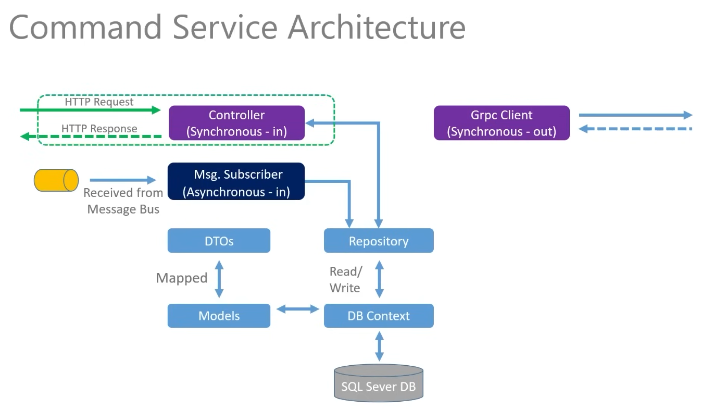

# .NET Core Microservices Project
This repository contains two microservices, CommandsService and PlatformService, along with Kubernetes configurations for deployment. Below, you will find an overview of the project structure, features, and setup instructions.
# Overview
This project demonstrates a microservices architecture built using .NET Core. It consists of two services:  
- CommandsService: Handles commands and related data. 
- PlatformService: Manages platform-related data and synchronization.

The services communicate via HTTP and support scalability and deployment using Kubernetes.
# Project Architecture
## PlatformService
## CommandsService

# Services
## CommandsService
CommandsService is a .NET Core Web API responsible for managing commands.
## Structure
- Controllers: Handles incoming HTTP requests.
- Data: Contains data access logic.
- Dtos: Defines Data Transfer Objects.
- Models: Represents domain models.
- Profiles: Contains AutoMapper configurations.
- Properties: Configuration files like launchSettings.json.
## Key Files
- CommandsService.csproj: Project file for the service.
- Dockerfile: Docker configuration for containerizing the service.
- appsettings.*.json: Configuration files for different environments.
- CommandsService.http: HTTP client configuration for testing API endpoints

# PlatformService
PlatformService is a .NET Core Web API responsible for managing platform data and synchronization.
## Structure
- Controllers: Handles incoming HTTP requests.
- Data: Contains data access logic.
- Dtos: Defines Data Transfer Objects.
- Migrations: Handles database migrations.
- Models: Represents domain models.
- Profiles: Contains AutoMapper configurations.
- SyncDataServices/Http: Manages HTTP-based data synchronization.
## Key Files
- PlatformService.csproj: Project file for the service.
- Dockerfile: Docker configuration for containerizing the service.
- appsettings.*.json: Configuration files for different environments.
- PlatformService.http: HTTP client configuration for testing API endpoints.

# Kubernetes Configurations
The project includes Kubernetes deployment and configuration files:
- commands-depl.yaml: Deployment configuration for CommandsService.
- ingress-srv.yaml: Ingress configuration for routing traffic.
- local-pvc.yaml: Persistent Volume Claim for local storage.
- mssql-plat-depl.yaml: Deployment configuration for MSSQL database.
- platform-depl.yaml: Deployment configuration for PlatformService.
- platforms-np-srv.yaml: NodePort service for PlatformService.
